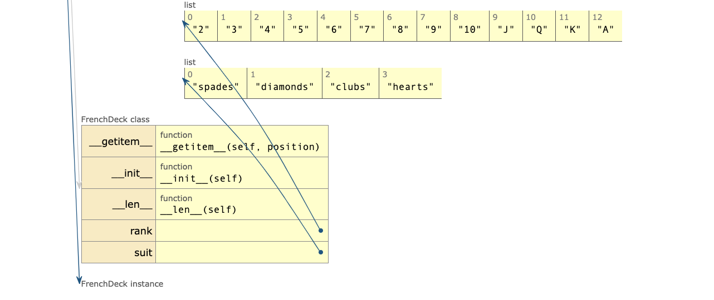

# special methods, or "dunder" methods

**Definition**:
- The Python Data Model, also known as the "protocol" or "dunder" (double underscore) methods, is a set of conventions and special methods that define how objects interact with the Python language. The python interpreter invokes these special methods when it performs certain operations on objects.

## How Python Uses Dunder Methods
- When you perform an operation involving an object, Python internally looks for the corresponding dunder method and calls it. For example:
  - When you call len(obj), Python internally calls obj.__len__().
  - When you access obj[0], Python calls obj.__getitem__(0).
  - When you add two objects with obj1 + obj2, Python calls obj1.__add__(obj2).
This mechanism allows objects to define their behavior for built-in operations, providing flexibility and consistency in how objects interact within the language.

## How dunber methods work internally in Python with example
Code: [FrenchDeck.py](1-python-data-model/french_deck.py) 

```python
import collections

Cards = collections.namedtuple('Card', ['rank', 'suit'])

```

This allows us to create card objects where we can access the rank and suit using dot notation (e.g., card.rank and card.suit), making the code more readable and easier to work with. check [collections.namedtuple](1-python-data-model/collections_namedtuple.md) for more details.

### Step 1: Instantiating `FrenchDeck`

```python
deck = FrenchDeck()
```

1. **Class Definition**: Python first reads and processes the `FrenchDeck` class definition. It sees that `FrenchDeck` has two class attributes (`rank` and `suit`), an `__init__` method, and two special methods (`__len__` and `__getitem__`).

2. **`__init__` Method Call**: When `FrenchDeck()` is called, Python allocates memory for a new `FrenchDeck` object. It then calls the `__init__` method to initialize the object.
   - **List Comprehension**: Inside the `__init__` method, the list comprehension `[Cards(rank, suit) for suit in self.suit for rank in self.rank]` is executed to create a list of `Card` namedtuples representing a deck of cards.
   - **Named Tuple Creation**: For each combination of rank and suit, a `Cards` named tuple is created, e.g., `Cards(rank='2', suit='spades')`.
   - **Assign to Instance Variable**: The resulting list of `Card` named tuples is assigned to `self._cards`.



### Step 2: Accessing an Element

```python
deck[0]
```

1. **`__getitem__` Method Call**: When `deck[0]` is executed, Python recognizes that `deck` is an instance of `FrenchDeck` and looks for the `__getitem__` method.
   - **Index Lookup**: The index `0` is passed as the argument `position` to the `__getitem__` method.

2. **Retrieve the Item**: Inside the `__getitem__` method, `self._cards[position]` is evaluated.
   - **List Indexing**: Since `self._cards` is a list, the indexing operation `self._cards[0]` retrieves the first element of the list.

3. **Return the Item**: The retrieved item, which is a `Cards` named tuple representing the first card in the deck, is returned.

### Summary of Internal Mechanisms

- **Object Creation**: Python allocates memory and initializes the `FrenchDeck` object.
- **Named Tuple Creation**: The `Cards` named tuples are created and stored in a list.
- **Dunder Method Invocation**: The `__getitem__` dunder method is automatically invoked when you use the indexing operation on the `deck` object.
- **List Indexing**: The list of cards is indexed to retrieve the specific `Card` named tuple.

### Operations that can be performed on Object using Dunder methods
#### Slice:
<details>
<summary>Click to expand</summary>

- Since the `__getitem__` delegate to the [] operator of self._cards, our deck automatically supports slicing. For example, `deck[:3]` will return the first three cards in the deck.
- Implementing the `__getitem__` method also makes our `FrenchDeck` iterable, allowing us to iterate over the deck using a `for` loop.
```python
for card in deck:
    print(card)
```
- When a collection lacks the `__contains__` method, Python performs a sequential scan using the `__iter__` method to check for membership. This involves iterating through the collection and comparing each element until a match is found or the end of the collection is reached. This default behavior ensures that the in operator works even for custom collections without optimized membership checks.

</details>

#### Random Choice:
<details>
<summary>Click to expand</summary>

- The `random.choice` function randomly selects an item from a collection. Since our `FrenchDeck` is iterable, we can use `random.choice(deck)` to pick a random card from the deck.

```python
from random import choice
choice(deck)
```
</details>

#### Sorting:
<details>
<summary>Click to expand</summary>

- The `sorted` function sorts a collection based on the default ordering of its elements. Since our `FrenchDeck` is iterable, we can sort the deck using `sorted(deck)`.

example: [sorting_deck.py](1-python-data-model/sorting_deck.py)

</details>

#### Shuffling:
- The `FrenchDeck` cannot be shuffled because it is immutable: the cards and their positions cannot be changed, except by voilation of the encapsulation. `_cards` is encapsulated because it is a private attribute (indicated by the leading underscore), and the class does not expose any methods to modify it.
- To shuffle the deck, you would need to change the order of the elements in `_cards`. This typically requires a method that can modify the list. However, because FrenchDeck lacks such a method, it is effectively immutable.


>> Note: The special methods are not meant to be called directly by the user. If `my_object` is an instance of a user-defined class, then Python calls the special method defined in the class. For example, `len(my_object)` internally calls `my_object.__len__()`.

>> The only exception is the `__init__` method, which is called explicitly when you create an object (e.g., `my_object = MyClass()`).

------

## String Representation
In Python, `__repr__` and `__str__` are special methods used to define how instances of a class are represented as strings. These methods serve different purposes and are used in different contexts.

### `__repr__` Method
- **Purpose**: The `__repr__` method is intended to provide an "official" string representation of an object. This representation should ideally be unambiguous and, if possible, match the code that could be used to recreate the object.
- **Usage**: The `__repr__` method is called by the `repr()` built-in function and by the interactive interpreter when you type the object at the prompt.
- **Goal**: The goal is to provide a string that could be used to recreate the object (if that makes sense) and is useful for developers during debugging.

### `__str__` Method
- **Purpose**: The `__str__` method is intended to provide a "pretty" or user-friendly string representation of an object. This representation is meant to be easy to read and provide a more informal summary of the object.
- **Usage**: The `__str__` method is called by the `str()` built-in function, and by `print()` function to convert the object to a string.
- **Goal**: The goal is to provide a readable, user-friendly description of the object.

### Differences Between `__repr__` and `__str__`

- **Intent**:
  - `__repr__`: Focuses on being unambiguous and useful for developers.
  - `__str__`: Focuses on being readable and useful for end-users.

- **Invocation**:
  - `__repr__` is used by `repr()`, the interactive interpreter, and in container types (like lists and dictionaries).
  - `__str__` is used by `str()` and `print()`.

- **Fallback**:
  - If `__str__` is not defined, Python will use `__repr__` as a fallback.
  - If neither `__str__` nor `__repr__` are defined, the default is the one inherited from `object`, which includes the object’s memory address.

### Example

Here’s an [example](1-python-data-model/string_rep.py) to illustrate `__repr__` and `__str__`:

### Explanation

- **`__repr__`**:
  - `__repr__` returns a string that looks like the code used to create the `Card` object: `Card(rank='7', suit='diamonds')`.
  - This is useful for debugging and logging where an unambiguous representation is needed.

- **`__str__`**:
  - `__str__` returns a more user-friendly string: `7 of diamonds`.
  - This is useful for display purposes, like printing the card's details in a readable format.

### Summary
- Use `__repr__` to provide a detailed and unambiguous string representation of an object, primarily for developers.
- Use `__str__` to provide a readable and user-friendly string representation of an object, primarily for end-users.
- If `__str__` is not defined, Python will use `__repr__` as a fallback.

reference: [SOF - Difference between __str__ and __repr__](https://stackoverflow.com/questions/1436703/what-is-the-difference-between-str-and-repr/1436756#1436756)